<div align="center">


# MarkFrame

**Abre cualquier archivo `.md`, de cualquier carpeta, y edítalo.**
Sin bóvedas, sin bibliotecas que mantener, sin configuración.
Como el Bloc de notas, pero que entiende markdown.

*Windows 11 · 4.9 MB · arranca en 110 ms*

</div>

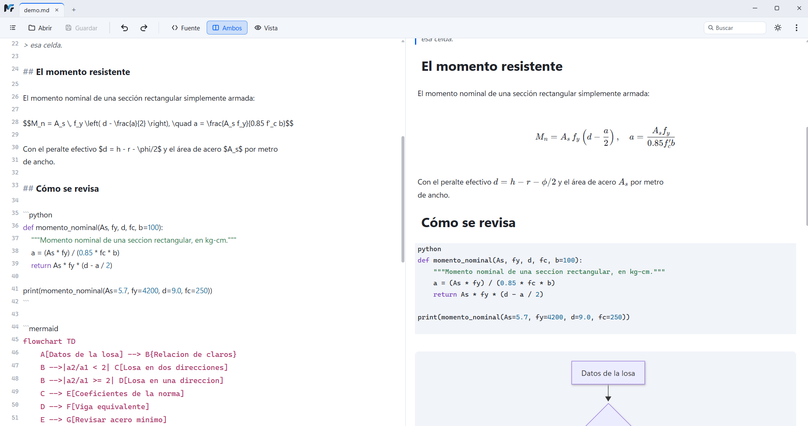

<sub>Los dos paneles a la vez, con la fórmula de KaTeX ya dibujada a la derecha y su fuente a la izquierda.</sub>

---

## Lo que hace distinto

**Los dos paneles son editables, a la vez.** El de la izquierda es el markdown;
el de la derecha, el texto formateado. Se escribe en cualquiera de los dos y el
otro sigue. No es una previsualización de sólo lectura, y tampoco es un editor
WYSIWYG que esconde la fuente: son las dos cosas al mismo tiempo.

Eso importa por una razón de fondo: **el panel formateado no es HTML**, es el
mismo texto con los marcadores decorados. Así que editarlo es editar markdown, y
**nunca hay una conversión de vuelta** que pueda comerse un renglón de una tabla.

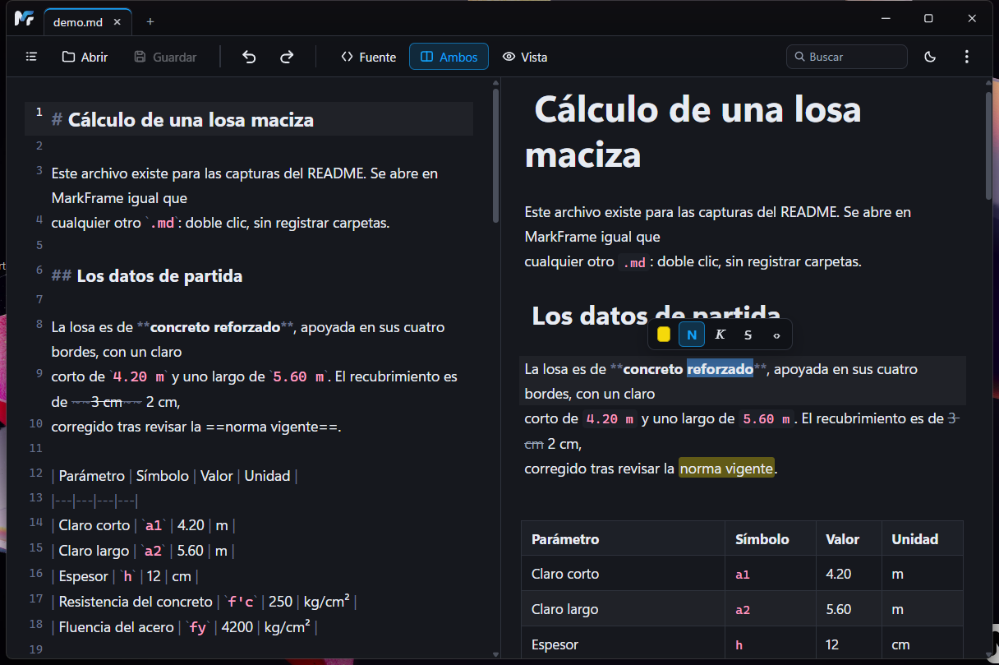

<sub>Seleccionas «reforzado», que ya está en negrita, y **la N sale encendida**. Los otros botones dicen lo que falta. Detrás, el panel de la izquierda ha saltado al mismo párrafo.</sub>

| | |
|---|---|
| **Tablas editables celda por celda** | Desde el panel formateado, con el markdown como fuente de verdad |
| **El panel de formato dice qué hay puesto** | Seleccionas texto y los botones muestran si ya está en negrita, cursiva, tachado o resaltado |
| **Índice del documento** | Los títulos salen del árbol de sintaxis, no de una expresión regular: un `# comentario` dentro de un bloque de código no es una sección |
| **Fórmulas y diagramas** | KaTeX y Mermaid, que siguen al tema claro u oscuro |
| **Pestañas** | Abrir un segundo `.md` desde el Explorador va a una pestaña, no a otra ventana |
| **El guardado es explícito** | `Ctrl+S`. Hubo autoguardado y se quitó: un roce del teclado se escribía a disco sin que nadie lo pidiera |

## Lo que **no** hace, a propósito

Esto no es una omisión pendiente: es el diseño.

- **No indexa carpetas y no tiene bóvedas.** Si un programa te obliga a registrar
  una carpeta antes de abrir un archivo, ya perdiste la pelea contra el doble
  clic. Aquí se abre el archivo que pediste y nada más.
- **Sin enlaces `[[wiki]]`, sin grafo, sin retroenlaces.** Todos necesitan
  indexar una carpeta, que es la bóveda por la puerta de atrás.
- **La búsqueda es dentro del archivo abierto**, por lo mismo.
- **Sin plugins.** Abren superficie de ataque, y este programa se toma en serio
  abrir un `.md` de procedencia desconocida.
- **Sin sincronización, sin cuentas, sin telemetría.** No se conecta a nada.
- **Sólo Windows**, y la interfaz sólo en español por ahora.

## Seguridad: el modelo de amenaza está escrito

Un `.md` es un archivo que te pueden mandar. Eso lo convierte en una superficie
de ataque, y no es teoría: al **Bloc de notas de Windows** le costó ejecución de
comandos por un enlace de markdown (CVE-2026-20841, CVSS 8.8) **siete meses
después** de estrenar el soporte de markdown. Typora acumula diez CVE.

MarkFrame pasó por una auditoría propia de seis fases, con el adversario
declarado: **un archivo markdown de procedencia desconocida.**

- **Los esquemas de enlace se validan por destino, no por prefijo.** `https:` y
  `mailto:` se abren en el navegador del sistema; `javascript:` y `data:` salen
  como texto plano y no hacen nada.
- **Las imágenes remotas no se descargan sin permiso.** Si el documento apunta a
  un servidor ajeno, sale un aviso en rojo: pedir esa imagen revelaría tu
  dirección IP a quien escribió el archivo. *De los editores de markdown
  revisados, el único que también lo hace por omisión es VS Code.*
- **Tope de dimensiones declaradas**, contra bombas de descompresión: un PNG de
  100 KB que declare 20000 × 20000 no se decodifica. Un plano A0 escaneado a 300
  ppp sí, y hay una prueba que lo fija.
- **El HTML embebido en un `.md` nunca se renderiza.**
- KaTeX con `trust: false` y Mermaid saneado.

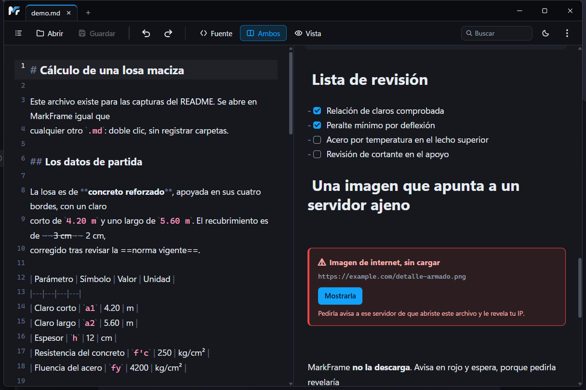

<sub>El documento pide una imagen a un servidor ajeno. MarkFrame no la trae: avisa, explica qué pasaría, y deja la decisión.</sub>

El informe completo, con lo que se encontró y lo que sigue abierto, está en
[`auditoria/INFORME.md`](auditoria/INFORME.md). Los precedentes —qué CVE le
costó a quién cada cosa que aquí se cierra— en
[`auditoria/precedentes.md`](auditoria/precedentes.md).

**112 pruebas** automatizadas: 81 de interfaz y 31 del núcleo en Rust.

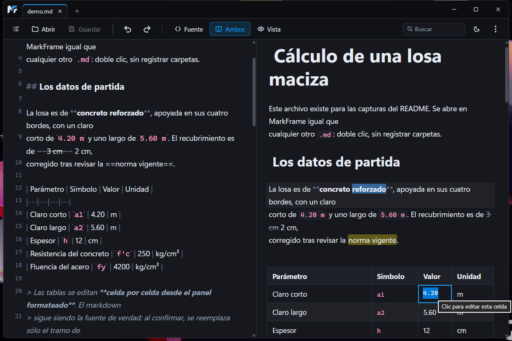

<sub>Un clic en la celda y se escribe encima. Al confirmar se reemplaza **sólo el tramo de esa celda** en el markdown de la izquierda —— nunca se reconstruye el documento leyendo el HTML.</sub>

## Cómo se ve

**Los tres modos.** Sólo la fuente, los dos paneles, o sólo el texto formateado:

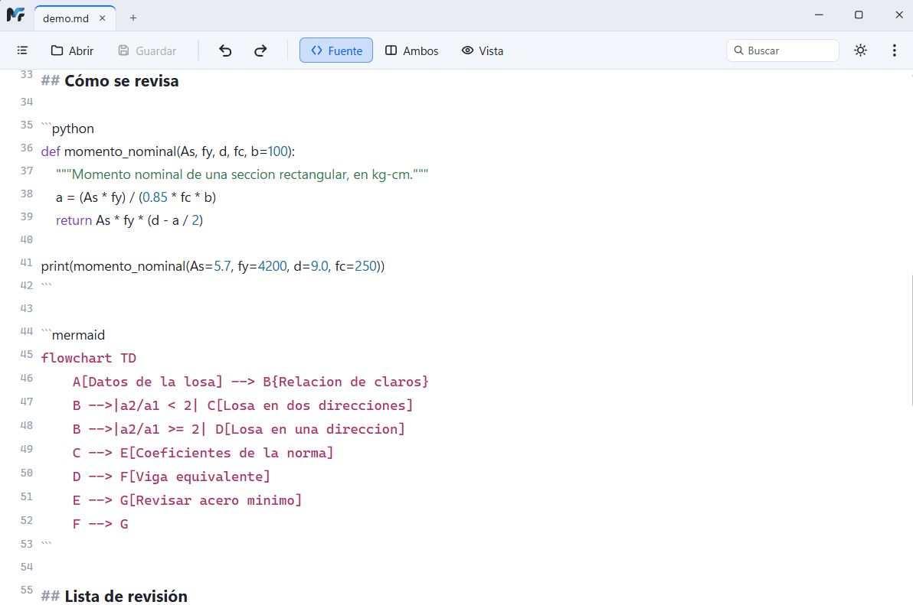

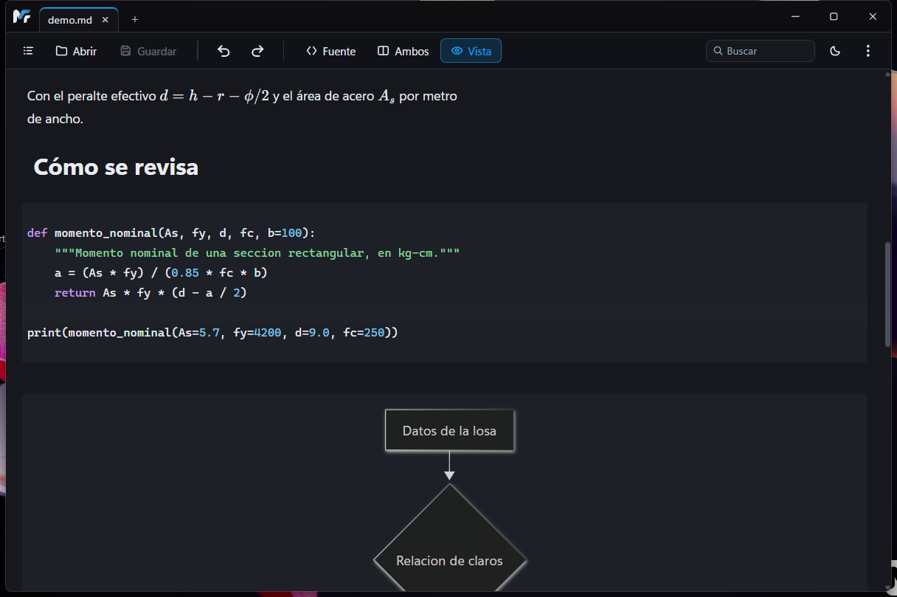

**El índice del documento**, con la sección actual marcada —— y el modo Vista detrás:

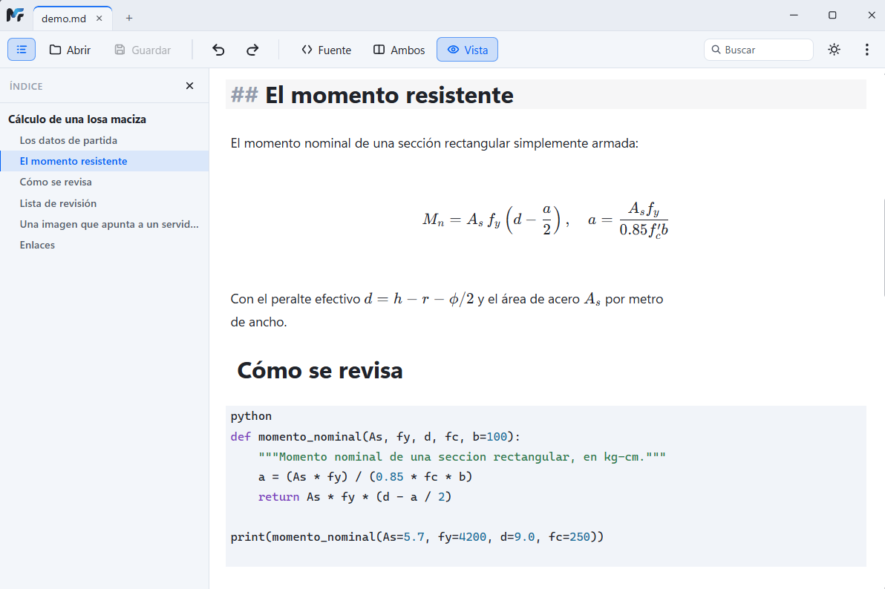

**Diagramas de Mermaid**, que siguen al tema:

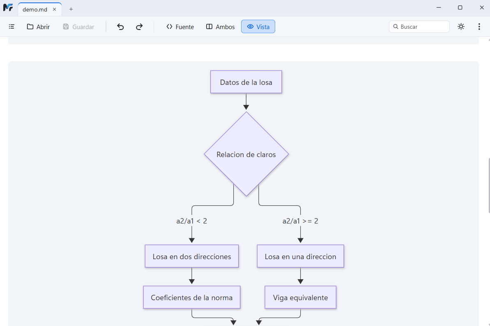

**Buscar dentro del archivo**, con contador y la coincidencia marcada en los dos paneles:

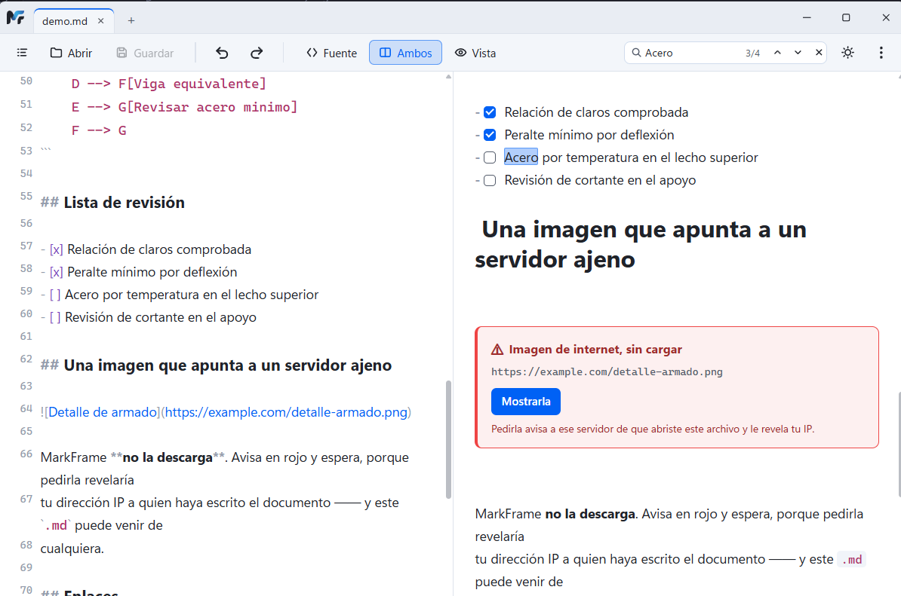

**Y en tema oscuro**, que es donde vive la mitad del tiempo:

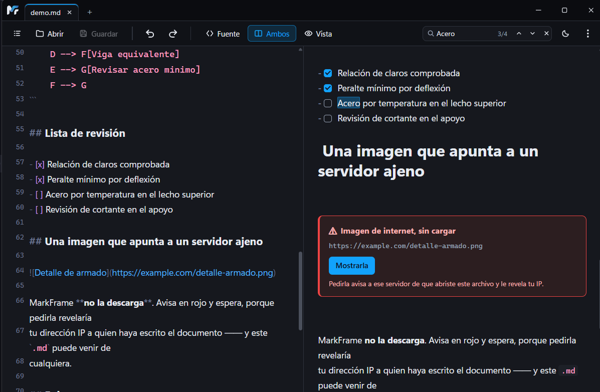

**La configuración entera**, sin botón de aceptar: cada cambio se aplica y se guarda al instante.

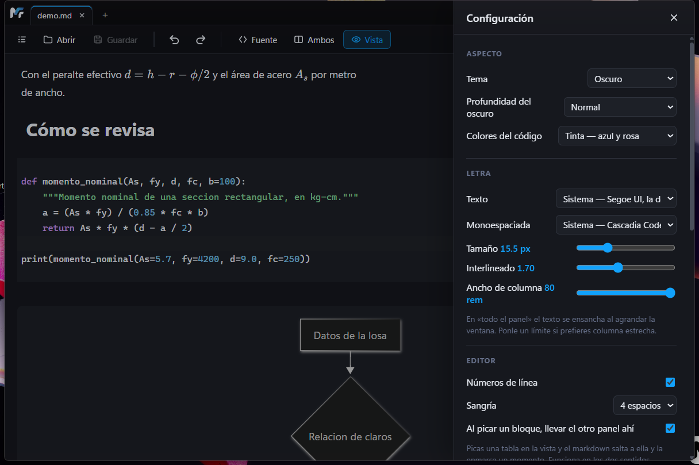

## Instalación

Descarga el instalador de la [última versión](../../releases/latest) y ejecútalo.

> **Windows va a decir «Editor desconocido».** El instalador **no está firmado**:
> un certificado cuesta una cuota anual y este programa se escribió para una
> máquina. Si eso te frena —y es razonable que te frene— tienes dos salidas:
> compara el SHA-256 del archivo con el que publica el release, o compílalo tú
> desde el código, que está entero aquí.

## Uso personal, sin soporte

Esto se construyó para el trabajo diario de una persona y se publica porque
puede servirle a alguien más, no como producto. **No hay soporte, no hay hoja de
ruta comprometida y los issues están cerrados.** Úsalo, cópialo, bifúrcalo,
haz lo que quieras con él —— la licencia es MIT.

## Desarrollo

```
npm install
npm run tauri dev      # ventana de desarrollo
npm run tauri build    # ejecutable e instalador
npm run probar         # las 81 pruebas de interfaz
```

Requiere Node y la cadena de Rust (`winget install Rustlang.Rustup`). Las
pruebas del núcleo van con `cargo test --manifest-path src-tauri/Cargo.toml`.

**Si vas a tocar el código, lee [`AGENTS.md`](AGENTS.md) primero** —— tiene las
tres reglas que este proyecto se salta a su costa. La especificación está en
[`ESPEC.md`](ESPEC.md) y el estado real, con sus trampas conocidas, en
[`docs/estado.md`](docs/estado.md).

## Licencia

MIT —— ver [`LICENSE`](LICENSE). Los avisos del software de terceros que va dentro
del ejecutable están en [`TERCEROS.md`](TERCEROS.md).
