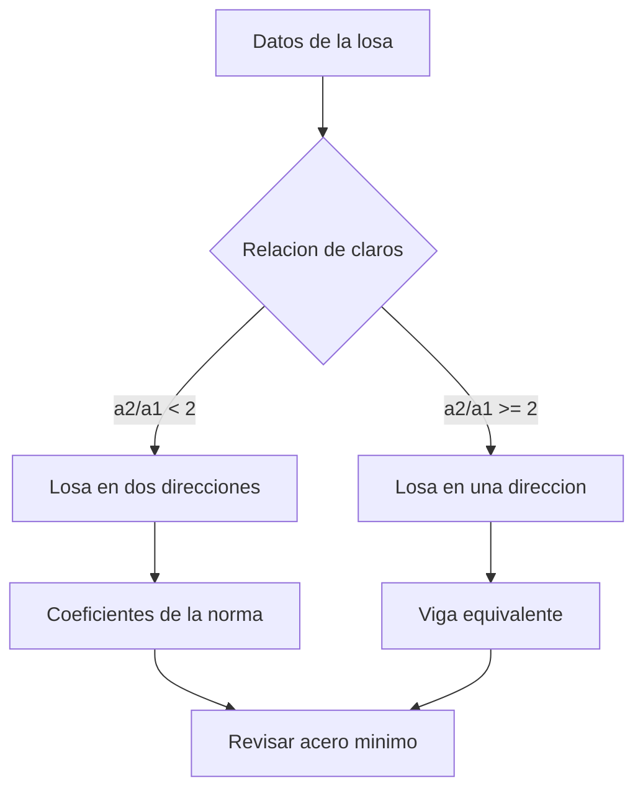

# Cálculo de una losa maciza

Este archivo existe para las capturas del README. Se abre en MarkFrame igual que
cualquier otro `.md`: doble clic, sin registrar carpetas.

## Los datos de partida

La losa es de **concreto reforzado**, apoyada en sus cuatro bordes, con un claro
corto de `4.20 m` y uno largo de `5.60 m`. El recubrimiento es de ~~3 cm~~ 2 cm,
corregido tras revisar la ==norma vigente==.

| Parámetro | Símbolo | Valor | Unidad |
|---|---|---|---|
| Claro corto | `a1` | 4.20 | m |
| Claro largo | `a2` | 5.60 | m |
| Espesor | `h` | 12 | cm |
| Resistencia del concreto | `f'c` | 250 | kg/cm² |
| Fluencia del acero | `fy` | 4200 | kg/cm² |

> Las tablas se editan **celda por celda desde el panel formateado**. El markdown
> sigue siendo la fuente de verdad: al confirmar, se reemplaza sólo el tramo de
> esa celda.

## El momento resistente

El momento nominal de una sección rectangular simplemente armada:

$$M_n = A_s \, f_y \left( d - \frac{a}{2} \right), \quad a = \frac{A_s f_y}{0.85 f'_c b}$$

Con el peralte efectivo $d = h - r - \phi/2$ y el área de acero $A_s$ por metro
de ancho.

## Cómo se revisa

```python
def momento_nominal(As, fy, d, fc, b=100):
    """Momento nominal de una seccion rectangular, en kg-cm."""
    a = (As * fy) / (0.85 * fc * b)
    return As * fy * (d - a / 2)

print(momento_nominal(As=5.7, fy=4200, d=9.0, fc=250))
```



## Lista de revisión

- [x] Relación de claros comprobada
- [x] Peralte mínimo por deflexión
- [ ] Acero por temperatura en el lecho superior
- [ ] Revisión de cortante en el apoyo

## Una imagen que apunta a un servidor ajeno


MarkFrame **no la descarga**. Avisa en rojo y espera, porque pedirla revelaría
tu dirección IP a quien haya escrito el documento —— y este `.md` puede venir de
cualquiera.

## Enlaces

- [La norma, en el sitio oficial](https://example.com/norma)
- [Escribirle al calculista](mailto:nadie@example.com)

Los enlaces `https:` y `mailto:` se abren en el navegador del sistema.
Un `javascript:` no: sale como texto plano y no hace nada.
